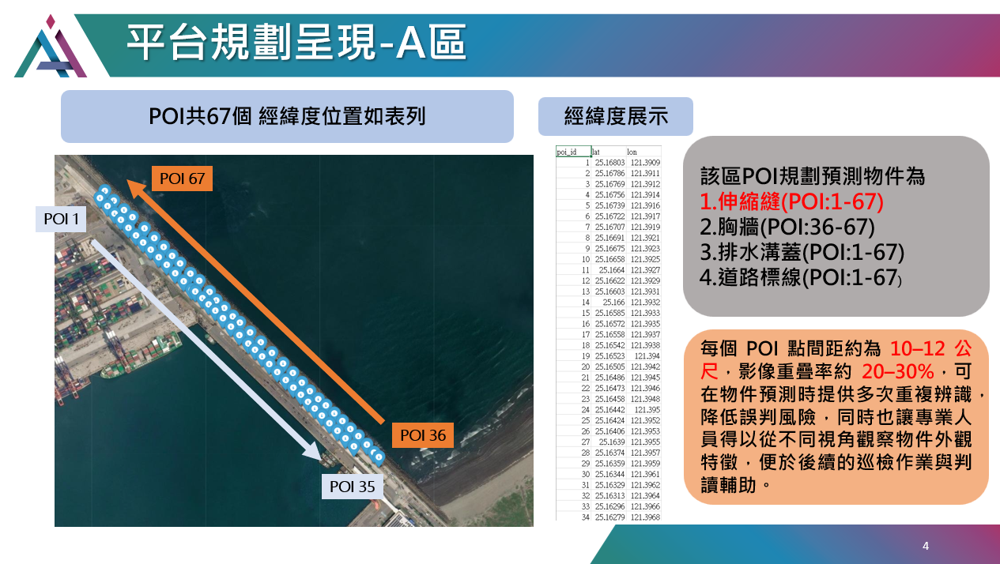
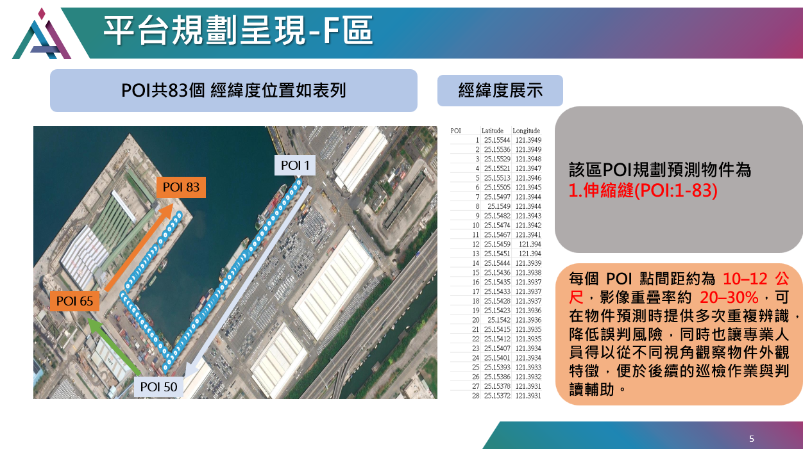
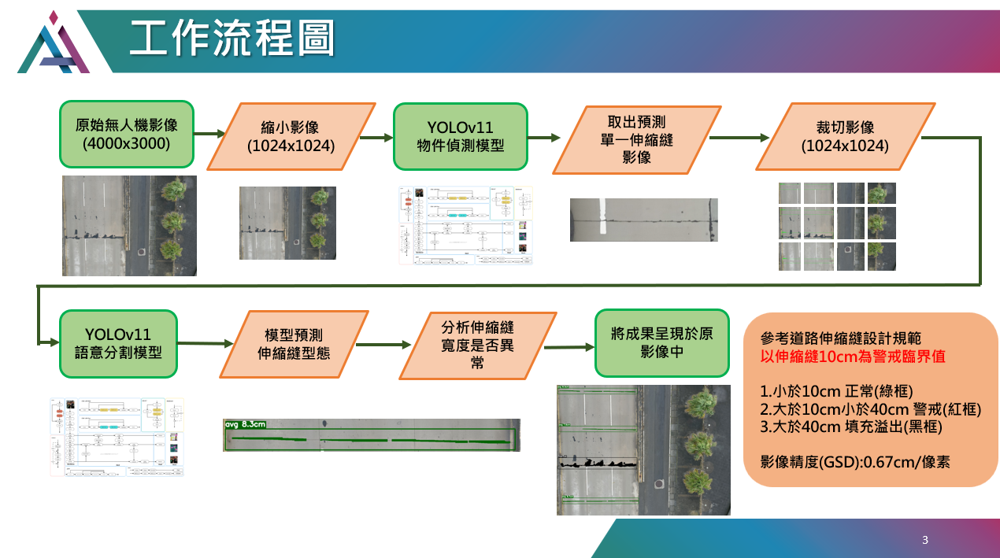

# Expansion Joint Inspection - 自動化伸縮縫檢測平台

本專案以 UAV（無人機）高空影像結合 YOLOv11 語意分割模型，進行港區伸縮縫自動化檢測與分析，支援 GPU (CUDA 12.4.1) 及 CPU 推論。

---

## 📍 平台規劃星現 -A區



- POI 共 67 個，經緯度位置於 poi 資料夾內
- 規劃預測目標：伸縮縫（POI: 1-67）、胸牆（POI: 36-67）、排水溝蓋（POI: 1-67）、道路標線（POI: 1-67）
- 當圖中有檢測到異常（顯示該 POI 點為紅色），否則為綠色
- 異常只有紅色的寬度才是異常，綠色與黑色為正常狀況
 
---

## 📍 平台規劃星現 -F區



- POI 共 83 個，經緯度位置於 poi 資料夾內
- 規劃預測目標：伸縮縫（POI: 1-83）
- 當圖中有檢測到異常（顯示該 POI 點為紅色），否則為綠色
- 異常只有紅色的寬度才是異常，綠色與黑色為正常狀況

---

## 🛠️ 工作流程圖



1. UAV 拍攝原始影像（4000x3000）
2. 影像縮小、切割（1024x1024）
3. YOLOv11 模型偵測伸縮縫與寬度
4. 根據設計規範進行分級判斷
5. 結果標示於原圖，輔助後續巡檢判讀

---

## ⚙️ Docker CUDA 12.4.1 部署教學

**建議流程：先下載專案，再用 Docker 建置環境執行**

### 1. 下載專案檔案
```bash
git clone https://github.com/xc6571260/expansion_joint_inspection.git
```

### 2. 拉取 CUDA 12.4.1 Image
```bash
docker pull nvidia/cuda:12.4.1-cudnn-devel-ubuntu22.04
```

### 3. 建置 Image
```bash
docker build -t expansion_joint:cuda12.4 .
```

### 4.1 執行 Container（支援 CUDA12.4）
```bash
docker run --gpus all -it --name expansion_joint-container ^
  -v D:/your_path/expansion_joint_inspection:/app ^
  -w /app ^
  expansion_joint:cuda12.4

```

### 4.2 執行 Container（用 CPU 推論）
```bash
docker run -it --name expansion_joint-container ^
  -v D:/your_path/expansion_joint_inspection:/app ^
  -w /app ^
  expansion_joint:cuda12.4

```

- `-v`：掛載本機專案資料夾（請依實際路徑調整）
- `-w`：設定工作目錄 `/app`
- 預設執行 `main.py`，推論結果輸出到 `/app/output/`

---
## 📂 專案結構

```
input/      # 原始影像
models/     # 模型檔案
output/     # 預測結果
utils/      # 輔助腳本
main.py     # 主程式
Dockerfile  # Docker 設定
requirements.txt
README.md
poi_A.png
poi_F.png
workflow.png

```

---

## 📢 注意事項

- 若需推論不同類型目標，請自行調整 input/output/model 內容
- 若有 GPU，建議使用 `--gpus all` 提升效能
- 推論結果會直接同步到本機 output 資料夾

---

## 👤 聯絡方式

- [xc6571260](https://github.com/xc6571260)
- r12521801@ntu.edu.tw
